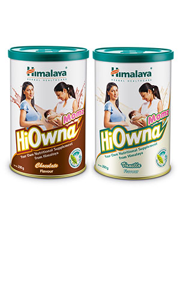

# Hiowna Momz

[TOC]

## Action
Hiowna Momz is a nutritional health drink supplement, containing natural ingredients, specially formulated to meet the additional nutritional requirements of pregnant and breast feeding women. Hiowna Momz helps bridge nutritional gaps and ensures optimum nutrition during pregnancy and lactation. It provides holistic benefits through its natural ingredients.

## Indications
* A specialized, daily nutritional health drink supplement for:
* Pregnancy
* Lactation

## Key ingredients
* Milk (Kshira) has been used in the form of skimmed milk powder in HiOwna Momz. Skimmed milk powder is a good source of essential amino acids. It is rich in casein, a highly nutritious protein, easily digestible and important for an infant's growth and development. The calcium helps to build strong bones and teeth in baby. Skimmed milk also contains whey proteins, which consist of branched-chain amino acids that are absorbed quickly, providing proteins that aid in baby's growth and development. They maintain the nutritional requirements of the mother and promote weight gain in the baby.

* Pea ([Kalaya](Kalaya.md)) is of great nutritional importance due to its high protein content. The amino acids in pea protein, along with the skimmed milk proteins, help in the development of the placenta and growth of the fetus.

* Date ([Kharjura](Kharjura.md)) offers antioxidant action. It effectively reduces stress, enhances strength and stamina, and rejuvenates the body. Dates have been traditionally used to promote lactation and provide nutrition and strength to nursing mothers.

* Chicory ([Kasani](Kasani.md)) is naturally high in inulin, which is known to have prebiotic action. Incorporation of inulin in the diet makes the digestive system more efficient at absorbing calcium, magnesium, iron, and zinc. Several studies have shown inulin to function as a prebiotic and promote good digestive health.

* Coconut ([Narikela](Narikela.md)) contains micro minerals and nutrients essential for human health. Coconut has folate and lauric acid along with other nutrients which help provide the additional nutritional requirements during pregnancy and lactation. Lauric acid increases the fatty acid content in breast milk, thus improving its quality.

* Apple (Seva) has a unique portfolio of polyphenols with antioxidant properties. Studies show that Apple increases the antioxidant enzymes in blood, including superoxide dismutase and glutathione peroxidase. Eating apples during pregnancy has a protective effect against childhood asthma in infants.

## Directions for use
* 2 heaped teaspoons/2 levelled scoops (approximately 25 g) twice daily.

## Side effects
## References

## References

1. Products of the Himalaya Drug Company
