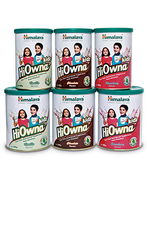

# Hiowna kidz

[TOC]

## Action
HiOwna kidz, a nutritional health supplement for children between the ages of two and ten, contains unique herbal ingredients and essential micronutrients and macronutrients that:
* Promote physical growth
* Promote mental growth
* Build immunity
* Provide balanced nutrition

## Indications
* As a supplement in promoting physical & mental growth and improving immunity
* As a nutritional drink during convalescence

## Key ingredients
* Pea (Kalaya) protein is a complete protein with all nine essential amino acids in a sufficient proportion to support normal body functions. The essential amino acid profile of pea protein is very close to that of ideal protein for humans as recommended by FAO & WHO.

* Finger Millet (Ragi) is a rich source of calcium & complex carbohydrates which improves digestive health & promotes physical growth.

* [Indian Gooseberry](Indian_Gooseberry.md) ([Amalaki](Amalaki.md)), is an antioxidant and an immunomodulator that helps improve phagocytosis.

* [Black pepper](Black_pepper.md) ([Maricha](Maricha.md)) contains piperine, which helps improve the secretion of bile, enhances digestion, and increases the bio- availability of digested nutrients.

* Centella (Mandukaparni), recognized in Ayurveda as a brain food, improves cerebral microcirculation, improves concentration and memory and offers anti-anxiety and anti-stress effects.

## Directions for use
* 2–6 years: One heaped teaspoon (approximately 12.5g) twice daily.
* 7–10 years: Two heaped teaspoons (approximately 25g) twice daily.
* Take a cup of lukewarm/cold milk or water, add the required tablespoons of HiOwna kidz and stir briskly until mixed well. Add sugar to taste, if required.

## Side effects
* HiOwna kidz is not known to have any side effects if taken as per the prescribed dosage.

## References

## References

1. Products of the Himalaya Drug Company
