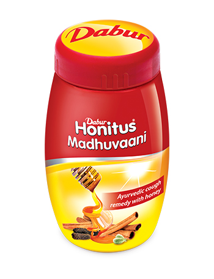

# Honitus Madhuvaani

Dabur Honitus Madhuvaani is a blend of age-old traditional cough formula which combines Sitopaladi churna with honey. It is premixed mixture provide effective relief from sore throat, cough and cold. It is a good anti allergic, expectorant and relieves congestion.
