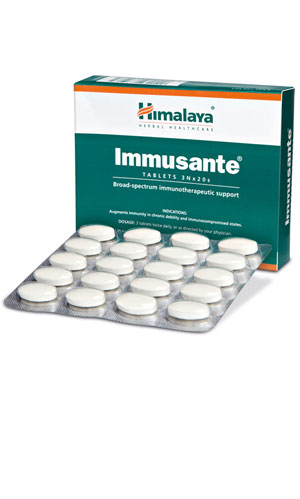

# Immusante

[TOC]

## Action
Immusante is a phytopharmaceutical formulation, recommended as immunotherapeutic support in situations where immunity is compromised, and one can easily contract infections. Immusante strengthens immune function, decreases disease manifestation, and improves resistance to diseases. Immusante works by modulating both cell-mediated immunity and humoral immunity.

## Indications
## Key ingredients
* Ayurveda texts and modern research back the following facts:
* Shanta ([Prosopis glandulosa](Prosopis_glandulosa.md)) has broad-spectrum antimicrobial activity.
* Lodhra ([Symplocos racemosa](Symplocos_racemosa.md)) possesses anti-inflammatory and antioxidant activities.

## Directions for use
* 2 tablets twice daily, or as directed by your physician.

## Side effects
## References

## References

1. Products of the Himalaya Drug Company
