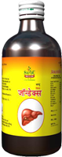

# Jaundex

[TOC]

For Jaundice and Hepatitis of any origin
## Medicinal  Uses
Jaundice and viral hepatitis
Drug induced hepatitis
Alcoholic hepatitis
Pre cirrhotic conditions
Adjuvant to hepatotoxic drugs like anti-TB medicines
As an adjuvant to anti-cancer drugs

## Mode of action
Jaundex has anti-inflammatory, hepatoprotective, antiviral, digestive and laxative properties. It reduces inflammation of liver cells and increases secretion of bile into small intestine.

## Benefits
1. Eliminates liver toxins out of body
1. Reduces serum billirubin, SGOT and SGPT levels
1. Stimulates bile flow and restores liver function
1. Improves appetite and digestion
1. Helps to regenerate the cells of Liver.
1. Improves patients compliance to anti TB and anti-cancer drugs

## Ingredients
Kutki (Picrorrhiza kurroa), Chirayata, (Swertia chirata), Daruharidra (Berberis aristata),  Guduchi (Tinospora cordifolia),  Bhumyamalaki (Phyllanthus niruri), Erand patra (Ricinus communis) and 8 more herbs

## Dose
2 teaspoonful 2 times a day
