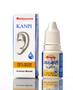

# Kanpi

[TOC]

## Importance
Effective for all types of ear disease like peroration, infection, pain and ottorhoea in ear.

## Dosage
put 4-5 drops in ear.

## Indications
1. Ottorhoea
1. Ear pain
1. Ear Infection
1. Perforation
