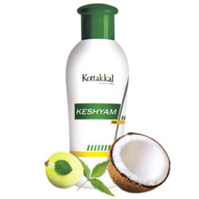

# Keshyam Oil

* Combination of powerful herbal ingredients for hair care
* Rich source of antioxidants
* Stimulates follicles and promotes hair growth
* Prevents hair fall and premature greying
* Improves natural hair colour
* Possesses anti dandruff and anti fungal activity
* Nourishing of hair on daily use

## Ingredients of Kottakkal Ayurveda
* Svetakutaja
* Kaidarya
* Bringaraja
* Guduci
* Amlaki
* Nimba
* Brahmi
* Yasti
* Kera taila
* Karpura
* Anti Oxidant
* Lemon oil
