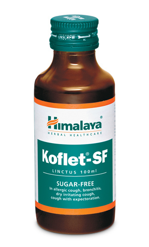

# Koflet-SF LINCTUS

[TOC]

## Action
Combats cough: Koflet-SF Linctus is beneficial in both productive and dry cough for people suffering from diabetes mellitus. The mucolytic and expectorant properties reduce the viscosity of bronchial secretions and facilitate expectoration. Koflet-SF Linctus peripheral antitussive (cough suppressant) action reduces bronchial mucosal irritation and related bronchospasms. In addition, the antiallergic, antimicrobial and immune-modifying properties provide relief from cough. The demulcent action of Koflet-SF Linctus soothes respiratory passages.

## Indications
* Cough of varied etiology in diabetics

## Key ingredients
* Ayurveda texts and modern research back the following facts:

* Holy Basil ([Tulasi](Tulasi.md)) possesses potent antihistaminic properties, which protect against pollen-induced brochospasms. Holy Basil is popularly used in catarrh and bronchitis due to its varied pharmacological properties.

* Licorice ([Yashtimadhu](Yashtimadhu.md)) has antitussive, expectorant and immune-enhancing properties that are helpful for relieving cough.

## Directions for use
* Please consult your physician to prescribe the dosage that best suits the condition.

## Side effects
* Koflet-SF Linctus is not known to have any side effects if taken as per the prescribed dosage.

## References

## References

1. Products of the Himalaya Drug Company
