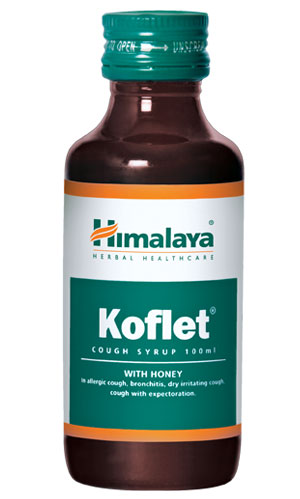

# Koflet

[TOC]

## Action
Combats cough:  Koflet is beneficial in both productive and dry cough. The mucolytic and expectorant properties reduce the viscosity of bronchial secretions and facilitate expectoration. Koflet’s peripheral antitussive (cough suppressant) action reduces bronchial mucosal irritation and related bronchospasms. In addition, the anti-allergic, antimicrobial and immune-modifying properties provide relief from cough. The demulcent action of Koflet syrup soothes respiratory passages.

## Indications
* Cough associated with acute and chronic upper and lower respiratory tract infections
* Smoker’s cough
* Cough due to chronic obstructive pulmonary disease (COPD)

## Key ingredients
* Ayurveda texts and modern research back the following facts:

Holy Basil ([Tulasi](Tulasi.md)) possesses potent antihistamine properties, which protect against pollen-induced bronchospasms. Holy Basil is used in catarrh (mucous membrane inflammation of the respiratory tract) and bronchitis due to its varied pharmacological usages.

Licorice ([Yashtimadhu](Yashtimadhu.md)) has antitussive, expectorant and immune-enhancing properties that are helpful in relieving cough.

Honey (Madhu) is traditionally used to treat cough, due to its anti-inflammatory properties, which soothe the respiratory tract. It inhibits the production of nitric oxide, which renders the herb its antioxidant property. This action is helpful in alleviating allergic respiratory disorders.

## Directions for use
* Please consult your physician to prescribe the dosage that best suits the condition.

## Side effects
* Koflet is not known to have any side effects if taken as per the prescribed dosage.

## References

## References

1. Products of the Himalaya Drug Company
