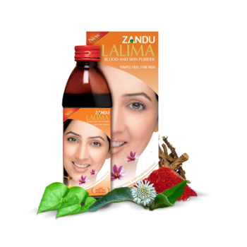

# Lalima

[TOC]

Lalima is a 100% Ayurvedic Blood & Skin purifier tonic which works from within cleansing/purifying the toxins from the blood which are the root cause of acne and dull skin. Regular intake of Lalima addresses the root cause i.e., Blood impurities and thereby imparts blemish free long lasting pinkish fairness.

## Composition
Each 5 ml (one teaspoonful) contains aqueous extracts of: Nimba - 75 mg, Keshar - 1 mg, Madhu(Honey) - 0.1 gm, Godhum Tel(wheat germ oil) - 5 mg, Bhringaraj - 75 mg, Triphala - 150 mg, Anantamool - 150 mg, Haridra - 150 mg, Manjistha - 75 mg, Guduchi - 75 mg, Katuki - 60 mg, Chirayta - 60 mg Flavoured sugar syrup base & Preservatives (Methyl Paraben 0.1%w/v, Propyl Paraben 0.02%w/v & Sodium benzoate 0.5%w/v) q.s.
Essence: Menthol - 1.0 mg, Camphor - 3.0 mg, Spearmint Oil - 3.75 mg. Excipients: Tween-80 - 10.0 mg, Citric Axid - 1.25 mg.

## Dosage
2 teaspoonful (10ml) twice a day.

* Sweet to taste; Lalima treats acne from the root, reduces occurrence of acne by purifying blood from inside "Do meethe Chamach andar, bedaag nihkhar bahar"
