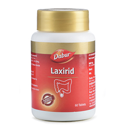

# Laxirid

Dabur Laxirid is an Ayurvedic formulation which aids in relieving constipation. It is made using Ayurvedic herbs such as Svarnapatri and Yavani, which are natural purgatives used to treat constipation.

## Key Ingredients
* Svarnapatri
* Yavani
