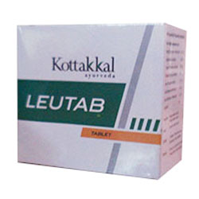

# Leutab

Excellent remedy for Leucorrhoea related issues. It is a unique herbal combinaton having anti bactirial, anti inflammatory and stringent action. Relieves from Itching associated with Leucorrhoea.

## Each Leutab Tablet is prepared out of
* Musali (Chlorophytum tuberosum) - 0.571g
* Khadira (Acacia catechu) - 0.571g
* Amalaki (Phyllanthus emblica) - 0.571g
* Trikantaka (Tribulus terrestris) - 0.571g
* Jambu (Syzygium cumini) - 0.571g
* Vari (Asparagus racemosus) - 0.571g
* Ikshu (Saccharum officinarum) - 0.571g
* Excipients q.s
