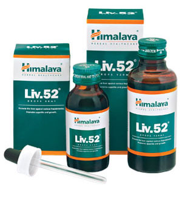

# Liv.52 drops

[TOC]

## Action
The natural ingredients in Liv.52 exhibit potent hepatoprotective properties against chemically-induced hepatotoxicity. It restores the functional efficiency of the liver by protecting the hepatic parenchyma and promoting hepatocellular regeneration.

## Indications
* For the prevention and treatment of viral hepatitis, alcoholic liver disease, pre-cirrhotic conditions and early cirrhosis, anorexia, loss of appetite and liver damage due to radiation therapy.
* Liver disorders including fatty acid associated with protein-energy malnutrition.
* Jaundice and loss of appetite during pregnancy.
* As an adjuvant during prolonged illness and convalescence.
* As a adjuvant to hemodialysis.
* As an adjuvant to hepatotoxic drugs like anti-tubercular drugs, statins, chemotherapeutic agents and antiretrovirals.

## Key ingredients
* Ayurveda texts and modern research back the following facts:
* The Caper Bush (Himsra) contains p-methoxy benzoic acid, which is a potent hepatoprotective. It prevents the elevation of malondialdehyde (biomarker for oxidative stress) levels in plasma and hepatic cells. Caper Bush also inhibits the ALT and AST enzyme levels and improves the functional efficiency of the liver and spleen. Flavonoids present in the Caper Bush exhibit significant antioxidant properties, as well.

* Chicory (Kasani) protects the liver against alcohol toxicity. It is also a potent antioxidant, which can be seen by its free radical scavenging property. The hepatoprotective property of Chicory suppresses the oxidative degradation of DNA in tissue debris.

## Directions for use
* Please consult your physician to prescribe the dosage that best suits the condition.

## Side effects
* Liv.52 is not known to have any side effects if taken as per the prescribed dosage.

## References

## References

1. Products of the Himalaya Drug Company
