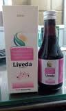

# Liveda Syrup

Liveda  removes excess fat and cholesterol that can clog your liver. This age-old herb Formulation helps filter toxins from your liver and kidneys.  It is a natural diuretic that can increase urine production by promoting the excretion of salts and water from the kidneys. It acts as a diuretic, digestive aid, laxative, internal inflammation of all kinds, edema, jaundice and anemia.

## SYRUP COMPOSITION
Each 10ml contains extracts of:-

* Bharingraj (Eclipta alba) -                           500mg
* Surpunkha (Tephrosia purpurea) -               500mg
* Punarnava (Boerhaavia diffusa) -             300mg
* Nagarmoth (Cyperus rotundus) -                 250mg
* Giloy (Tinospora cordifolia) -                     250mg
* Viavidanga (Embelia ribes) -                       200mg
* Kalmegh (Andrographis peniculata) -         200mg
* Pitpapara (Fumeria indica) -                       200mg
* Saunf (Foeniculum vulgare) -                      100mg
* Kutki (Picrorhiza kurroa) -                           100mg
* Sowa (Anethum sowa) -                               100mg
* Papal (Piper longum) -                                  50mg
