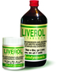

# Liverol syrup

[TOC]

## Importance
Useful in Anaemia, Jaundice, Weakness, Inflammations, Hepatic Failure, Hyper- Spleens, Dyspepsia, Mal-Absorption Syndrome, Anorexia, Indigestion, Haemorrhoids, Intestinal Tuberculosis

## Dosage
10-15 ML twice in a day or as directed by physician

## Indications
1. Hyperacidity
1. Dyspepsia
1. Indigestion
1. loss of appetite
1. Jaundice
1. Abdominal colic
1. Constipation
1. Dysentery
1. Enlargement of spleen
