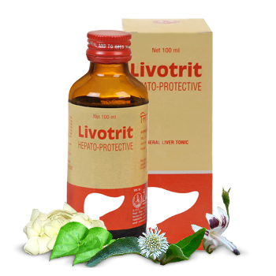

# Livotrit

[TOC]

The trusted hepatoprotective. Indications: Acute and chronic viral hepatitis, jaundice. Adjuvant to AKT. Chronic liver dysfunctions. Pre-cirrhotic conditions. As a daily health supplement to alcoholics to provide protection against hepatic damage.

## Composition
Livotrit Liquid Each 5ml contains- Guduchi(Tinospora cordifolia) 200 mg Punarnava(Boerhaavia diffusa) 200 mg Bhringraj(Eclipta alba) 100 mg Kurchi(Holarrhena antidysenterica) 100 mg Kalmegh(Andrographis paniculata) 100 mg Katuki(Picrorrhiza kurroa) 100 mg Vidanga(Embelia ribes) 75 mg Kalipath(Cissampelos pareira) 75 mg.

## Dosage
Livotrit tablets
Adults: 2 tablets twice or thrice a day. Children: 1 tablet twice or thrice a day. Livotrit liquid Adults: 1-2 teaspoonful twice or thrice a day. Children: 1/2-1 teaspoonful twice or thrice a day (3-12 years).

* Protects liver from hepatotoxic drugs, alcohol, infection and various other heptotoxins. Significant clinical results in viral hepatitis. Co-administered as an adjuvant to AKT to avoid hepatocellular damage. Promotes hepatocellular regeneration. Promotes biliary flow. Hastens normalizing of biochemical parameters in liver disorders thereby improving appetite and digestion. Controls the symptoms of nausea and vomiting in hepatic dysfunction.
