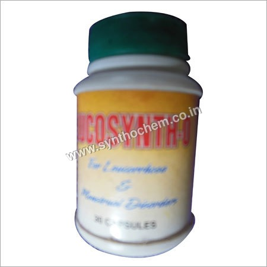

# Locosynth-O

**Locosynth-O** - Locosynth-O Capsule used for the treatment of leucorrhoea and gynaecological disorders.

## External Links
* [Synthochem](http://www.synthochem.co.in/locosynth-o-capsule-1526278.html)
