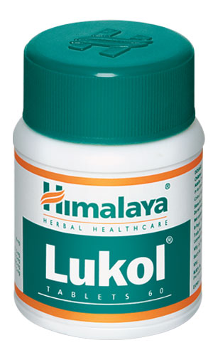

# Lukol

**Lukol** stimulates the endometrium (inner membrane of the uterus), normalizes the tone of uterine musculature and improves blood circulation.

**Treats leukorrhea:** The drug has potent antimicrobial and antifungal properties that combat the bacteria responsible for leukorrhea and pelvic inflammatory disease (PID). It also acts as an astringent on the mucus membrane of the genital system.

**Pain relief:** Lukol’s anti-inflammatory, analgesic and antispasmodic properties alleviate pain and other symptoms associated with PID and leukorrhea.

## Key ingredients
**Asparagus** (Shatavari) has antifungal and antioxidant properties that work synergistically to eliminate common fungi that cause leukorrhea and PID. The herb also soothes aches and pains because of its analgesic and anti-inflammatory properties.

**Fire Flame Bush** (Dhataki) has potent antimicrobial properties, which combat bacteria that causes leukorrhea and PID.

**Spreading Hogweed** (Punarnava) has anti-inflammatory and antispasmodic properties, which are beneficial in alleviating symptomatic pain.
