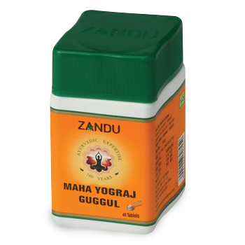

# Maha Yograj Guggul

[TOC]

Traditional formula designed to reduce excess vata in the system. Useful for accumulated vata in the joints and muscles, which may be indicated by cracking or popping of the joints, tics, spasms or tremors. Chronic accumulation may lead to such serious conditions as rheumatism and arthritis. In vata-type arthritis, the joints may feel cold to the touch and although not necessarily swollen, they may be dry and painful, especially upon movement. Rasayan with rejuvinating properties.Used in musculo-skeletal disorders, Maha yogaraj Guggul is not only anti-inflammatory and safe in long run but has medicinal herbs which strengthen the system and extend remission, through its health enhancing herbs.

## Composition
Abhrak Bhasma, Vang bhasma, Loha bhasma, Makshik bhasma, Mandur bhasma, Nag bhasma, Rasa sindur, Yograj guggulu.

## Dosage
1 to 4 tablets three times a day with milk or Maha Rasnadi Quath or Luke warm water or as directed by physician.

* Contains a synergistic blend of detoxifying herbs, including Triphala, Chitrak and Vidanga, that work in conjunction with guggulu to remove excess vata from the joints as well as the nerves and muscles. Useful in synovitis, Paraplegia, Sciatica, Hemiplegia, Nervous affections, Anaemia, Chorosis, Nervous affections, Anaemia, Chorosis, Heart affection, Scrofula, Rheumatism and Osteo- Arthritis. Indication Vatvikar. , Arthritis, Rheumatism, Joint pain Dysmenorrhoea, NIDDM, Hemorrhoids.
