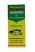

# Mahanarayana Tail

[TOC]

## Uses
### General
### Indications under which the medicine is prescribed
## How to use
## Known side effects
## Ingredients
## Shelf life
## Preparation method
## Availability
## Photo Gallery
## References
## External Links
## Importance
Effective oil for curing all the Vata Ragas, joint and muscular pain.smooth massage of mahanarayana tel provide fast & long lasting relief from joint pains, backache, ribs pain and calf injuries.it si very helpful in strengthening muscles and bones. Effective massage oil in all types of body joints pain.

## Dosage
Put few drops of Mahanarayana Tel on hand and massage the infected joint of body smoothly.

## Indications
* Useful for all types of joint pain like
1. Joint Pain
1. Body Pain
1. Arthritis
1. Vat Rogas
1. Calf Injuries
