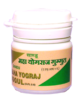

# Mahayograj Guggul no.1

[TOC]

**It has anti-oxidant action**
1. Provides strength to muscles, ligaments and nerves
1. Corrects metabolism and provides strength to the body
1. Relieves nerve irritation
1. Relieves pain, stiffness and inflammation
1. Potentates the action of other medicines

## Ingredients
1. Carum roxburghianum
1. Brassica campestris
1. Centratherum anthelminticum
1. Piper longum
1. Vanga bhasma
1. Nagbhasma
1. Rajata bhasma
1. Abhrak bhasma
1. Loha bhasma
1. Rassindur
1. Trikatu etc.

## Indications
1. Osteoarthritis
1. Rheumatoid arthritis
1. Gout
1. Dysmenorrhoea
1. NIDDM
1. Hemorrhoids

## Dosage
1 tablet 2 times per day
