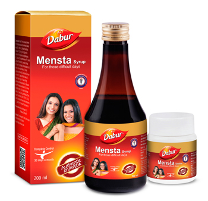

# Mensta

**Dabur Mensta syrup** is a unique herbal formulation which helps relieving problems related to the female reproductive system. It is the first non-hormonal menstrual modulator, which helps treat a variety of menstrual disorders with its anti-inflammatory and anti- spasmodic action.

## Why Dabur Mensta?
* Regularizes menstrual cycle
* Reduces inflammation of uterine tissue
* Relieves muscle cramps & abdominal pain
* Herbal cure for Poly Cystic Ovary Syndrome (PCOS)
* Reduces abnormal bleeding
