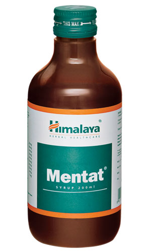

# Mentat syrup

[TOC]

## Action
Enhances memory and learning capacity:  The natural ingredients in Mentat improve mental quotient, memory span and concentration ability.

* Treats neurological disorders: Mentat reduces the level of tribulin, an endogenous monoamine oxidase inhibitor that is elevated during anxiety. The calming effects of Mentat are beneficial in treating insomnia and convulsions.

* As an adjuvant in neurological diseases: Due to its anticholinesterase (antispasmodic), dopaminergic-neuroprotective (important neurotransmitter in the brain), adaptogenic and antioxidant properties, Mentat is useful as an adjuvant in the treatment of epilepsy and enuresis.

## Indications
* Memory and learning disorders – attention fluctuation, concentration impairment, language and learning disability
Behavioral disorders – hyperkinetic states, asocial behavior, temper tantrums, aggressive behavior, enuresis.
* Attention deficit hyperactivity disorder (ADHD).
* Anxiety and stress-related disorders.
* Mental fatigue.
* Enuresis.
* Supportive therapy in mild to moderate mental retardation.
* As an adjuvant in epilepsy.

## Key ingredients
* Ayurveda texts and modern research back the following facts:

* Thyme-Leaved Gratiola ([Brahmi](Brahmi.md)) maintains cognitive function. Well known for its nootropic (memory enhancer) effect, the herb enhances memory and learning. It is also known to calm restlessness and is used to treat several mental disorders.

* Indian Pennywort ([Madhukaparni](Madhukaparni.md)) possesses antiepileptic properties and is commonly used as an adjuvant to epileptic drugs. It balances amino acid levels, which is beneficial in treating depression. It also prevents cognitive impairment.

* Winter Cherry ([Ashvagandha](Ashvagandha.md)) is used as a mood stabilizer in clinical conditions of anxiety and depression. Withanolides, the chemical constituents present in Winter Cherry, possess rejuvenating properties. The herb also reduces oxidative stress, which can cause mental fatigue.

## Directions for use
* Please consult your physician to prescribe the dosage that best suits the condition.

## Side effects
* Mentat is not known to have any side effects if taken as per the prescribed dosage.

## References

## References

1. Products of the Himalaya Drug Company
