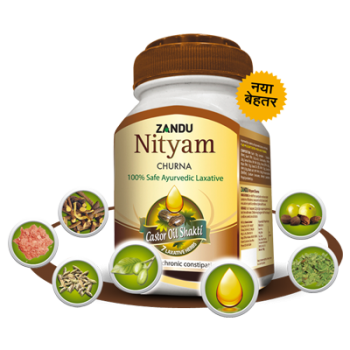

# Nityam Churna

[TOC]

Nityam Churna, an Ayurvedic laxative developed by Padmashree , Vaidya Suresh Chaturvedi& panel of experts, is a revolutionary formulation enriched with 7 POWERFUL LAXATIVE HERBS like castor oil, triphala&saunf. It gently cleanses, lubricates & moisturizes intestinal walls ensuring regular bowel movements.

## Composition
Each 100 gm contains: Emblicaofficinalis (Fr)- 3g, Terminaliachebula (Fr)- 3g, TerminaliaBelerica (Fr)- 3g, GlycyrrhizaGlabra (Rt)- 5g, FoeniculumVulgare (Fr)- 9g, Cassia Angustifolia (Lf)- 50g, Terminaliachebula (Fr)- 6g, Sanchal- 18g, RicinusCommunis (Ol)- 1g, Bambusaarundinacia (S.C.)- QS,excipients QS

## Dosage
Add 1-2 teaspoonful (4-8 gm) of Zandu Nityam Churna to a glass of water. Stir gently and consume at bed time. Individual results may vary, dose may be adjusted accordingly. If condition persists, consult doctor. The product is not recommended during Pregnancy.

* 100% Ayurvedic Laxative
It is safe to use and not habit forming.
It has 7 laxative ingredients along with 1000 years of time tested solution - Castor oil shakti.
