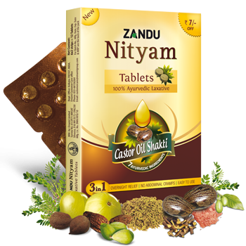

# Nityam Tablet

[TOC]

New Zandu Nityam Tablet is a unique formulation enriched with 7 powerful Ayurvedic ingredients like Castor Oil, Senna, Saunf & Triphala. It gently cleanses & soothes intestinal walls ensuring regular bowel movement without any abdominal cramps and is also effective on associated problems like gas, acidity, & flatulence. Now experience relief from chronic constipation with Zandu Nityam Tablet anywhere. Feel light & active all day long.

## Composition
Each Tablet Contains: Extracts of Svarnapatri (Cassia Angustifolia) Leaves-250.0 mg, Haritaki(Terminalia Chebula)Fruits- 45.0 mg, Yasti (Glycyrrhiza Glabra) Stem & Root- 15.0 mg, Triphala( Emblica Officinalis, Terminalia Chebula & Terminalia Bellerica) Fruits- 54.0 mg, Powder of Mishreya (Foeniculum Vulgare) Fruits-110.0mg, Sanchal-12.0mg, Sarjika Kshara- 7.5 mg, Oil of Eranda (Ricinus Communis) Seeds- 2.5 mg, Excipients- Q.S.

## Dosage
1-2 tablets to be taken with water at bed time or as advised by the physician. Individual results may vary, dose may be adjusted accordingly. The product is not recommended during Pregnancy.

## 3 In 1 Benefit
1. Overnight relief
1. No abdominal cramps
1. Easy to use
