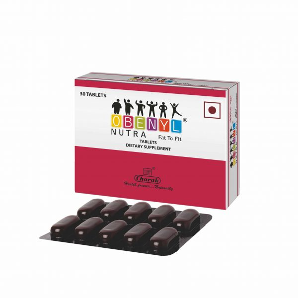

# Obenyl Nutra

**OBENYL NUTRA** is the only formulation with the unique combination of nutraceuticals & phytomedicines to support obesity management. OBENYL NUTRA not only regulates metabolism but also prevents the inevitable complications of obesity. OBENYL NUTRA helps to suppress appetite by modulating serotonin levels (brain neuro-transmitter). Low levels of serotonin are linked to depression and anxiety, which drive many people to eat emotionally. Thus, as serotonin levels rise, mood improves and lessens the drive .
