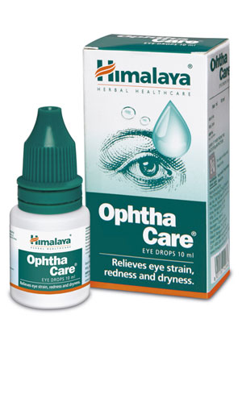

# OphthaCare

**OphthaCare** has potent antimicrobial and antihistaminic properties, which combat infective and allergic eye disorders.

**Provides symptomatic relief:** The drug’s analgesic property relieves pain, and its anti-inflammatory property is effective in soothing inflammation. OphthaCare heals wounds quickly, protects ophthalmic tissue from local oxidative damage, and its cooling effect alleviates eye irritation.

## Key ingredients
**Honey** (Madhu) effectively eliminates a host of microorganisms. It is an anti-inflammatory agent which soothes the eyes and heals wounds quickly.

**Persian Rose** (Satapatri) is well-known for its cooling property, when applied to the eyes. It provides relief from eyestrain and computer vision syndrome and exhibits antibacterial activity.
