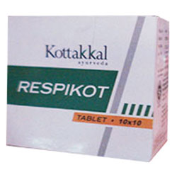

# Respikot Tablet

[TOC]

Respikot Tablet is a formulation based on Dasamulakatutrayadi Kwatham described in Shasrayogam for managing different types of respiratory ailments. The unique herbal combination helps to keep antioxidants at optimum level and normalizes respiration. It functions as an immuno-modulator that helps in desensitization against allergens.

## Indications for use of Respikot Tablet
Bronchitis & Asthma.

## Each Respikot Tablet is prepared out of
* Vilwam (Aegle marmelose)
* Kasmari (Gmelina arborea)
* Patala (Stereospermum colais)
* Syonaka (Oroxylum indicum)
* Agnimantha ( Premna corymbosa)
* Salaparni (Pseudarthria viscida)
* Prisniparni (Desmodium gangeticum)
* Brihati (Solanum indicum)
* Gokshura (Tribulus terrestris)
* Krishna (Piper longum)
* Nagara ( Zingiber officinale)
* Maricha ( Piper nigrum)
* Vrisha (Justicia beddomei)
* Excipients q.s
