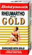

# Rhemartho Gold

[TOC]

## Importance
Rheumartho gold capsule is excellent remedy for Chronic Vat diseases. it is also Useful in Vat diseases to relieve pain and inflammation. Effective in Rheumatism, Arthritis and Sciatica. Relieves the problem with painful joints like inflammation, chronic pain and stiffness.

## Dosage
1-2 capsule twice in a day or as directed by physician

## Indications
1. Body Joints pain
1. Painful Disorder
1. Arthritis
1. Rheumatoid Arthritis
1. Gout
1. Paraparesis
1. Joint stiffness
