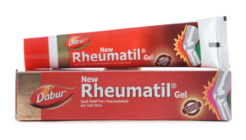

# Rheumatil Gel

**Dabur Rheumatil Gel** is effective in providing quick relief from rheumatism related joint pain. It is also effective in treating pain from Arthritis, Fibrositis, Stiff neck, Lumbar Spondylitis, Frozen Shoulders, Lumbago, Backaches, Muscular Sprains and Spasms.

It contains a combination of Wintergreen oil, Eucalyptus oil, Clove oil, Ginger oil and Cinnamon oil along with other Ayurvedic ingredients to battle joint pain.

**Usage**
* Apply gently on affected areas. Massage not required.
