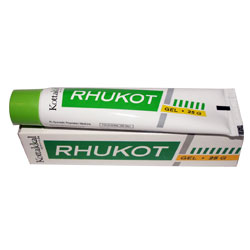

# Rhukot Gel

[TOC]

Rhukot Gel is a formulation for topical application comprising of two specific oils Cedrus deodara oil and Asadirachta indica (Neem) Oil. Application of gel as an adjuvant with Rhukot tablet helps in quick relief of pain and swelling.

## Indications for use of Rhukot Gel
Arthritic pain and Joint pain. Rheumatoid arthritis/ Osteo arthritis.

## Each 5g Rhukot Gel is prepared out of
* Devadaru (Cedrus Deodara) - 0.675g
* Nimba (Azadirachta indica) - 0.675g
* Gel Base q.s
* Perfume q.s
