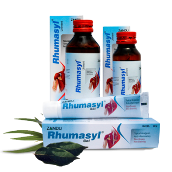

# Rhumasyl

[TOC]

Mobility unparallelled.Indication: Useful as a topical application for osteoarthritis and rheumatoid arthritis, sports injury, sprain, back pain, leg cramps, myalgia, lumbago, sciatica, neuralgia, frozen shoulder an spondylitis.

## Composition
Liniment Each 10ml is prepared from- Maha Mash Taila 2.5 ml Vishgarbha Taila 2.5 ml Narayan Taila 2.5 ml Gandhapuro Taila (Oil of Gaultheria) 2.5 ml
Gel Composition: Maha Mash Taila 13% v/w Vishgarbha Taila 13% v/w Narayan Taila 13% v/w Gandahpuro Taila (oil of Gaultheria) 13% v/w

## Dosage
For prompt relief of musculo-skeletal pain and stiffness. Faster penetration that hastens the recovery from pain. Stimulates blood circulation and generates warmth at the site of application. Reduces inflammation and improves joint mobility.

* For prompt relief of musculo-skeletal pain and stiffness. Faster penetration that hastens the recovery from pain. Stimulates blood circulation and generates warmth at the site of application. Reduces inflammation and improves joint mobility.
