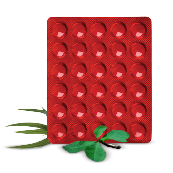

# Rhumayog

[TOC]

All painful inflammatory conditions such as: Degenerative joint disorders, Osteoarthritis, Rheumatoid arthritis, Ankylosing spondylitis, Lumbago, Frozen shoulder.

## Composition
Each tablet contains- Yograj guggul 30 mg Maharasnadi quath(solid extract) 235 mg Bang Bhasma 5 mg Nag Bhasma 5 mg Loh Bhasma 5 mg Mandur Bhasma 5 mg Makshik Bhasma 5 mg Abhrak Bhasma 5 mg Rasa sindur 5 mg.

## Dosage
2 tablets thrice a day.

* A safe and effective Ayurvedic anti inflammatory drug drug for the treatment of arthritis and other musculo skeletal disorders. Relieves joint pain and inflammation fast, with minimal gastric irritation. Safe for prolonged use. First choice anti inflammatory therapy in patients where NSAIDS are contraindicated. Potentiates the anti inflammatory action of NSAIDs if given as a co-therapy. Reduces the dosage of NSAIDs and consequently their side effects.
