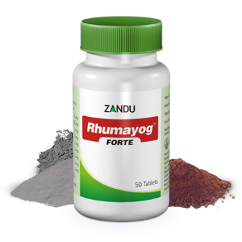

# Rhumayog Forte

[TOC]

Zandu introduces extract based Forte Range of products in attractive HDPE container, herbs in extract form (100% soluble fraction) ensures better bioavailability; confirms the superiority & potency of Forte formulation with just 1 tab BD dosage.Its indication is Osteoarthritis

## Composition
Maharasnadi Quath-470 mg (solid extract), Yograj Guggul-60 mg, Lauha Bhasma-20 mg, Bang Bhasma-10 mg, Mandur Bhasma-10 mg, Makshik bhasma-10 mg, Abhrak Bhasma10 mg.

## Dosage
1 tablet twice daily or as directed by the physician.

* Extract based formula ensures better efficacy, potency & better disease control.
Better patient compliance with just 1 tab BD dosage compare to 2 tablet BD or TID conventional dosage.
Derived from natural source, no side effects or adverse effects reported.
