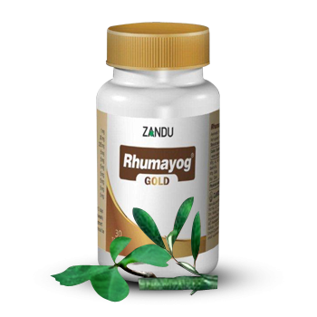

# Rhumayog Gold

[TOC]

Gold standard anti-rheumatic. Indication: Rapidly progressing rheumatoid arthritis.

## Composition
Composition: Each tablet contains- Suvarna Bhasma 1 mg Yograj guggul 30 mg Maharasnadi quath(solid extract) 235 mg Bang Bhasma 5 mg Nag Bhasma 5 mg Loh Bhasma 5 mg Mandur Bhasma 5 mg Makshik Bhasma 5 mg Abhrak Bhasma 5 mg Rasa Sindur 5 mg.

## Dosage
Initially, one tablet twice daily (BD) for first 15 days, followed by 2 tablets twice daily at weekly intervals or as directed by the physician.

* Corrects the immunological abnormalities and hence restores the balance of disturbed immune system. Gold in the form of Suvarna Bhasma(a finely micro pulverized form ) is safe with low blood levels of Gold. Gold selectively accumulates in the synovial cells of the inflamed joints and exerts immuno-modulatory activity. Rhumayog with Gold inhibits PG synthesis and arrests the rapid progression of the disease. Ensures greater mobility without pain.
