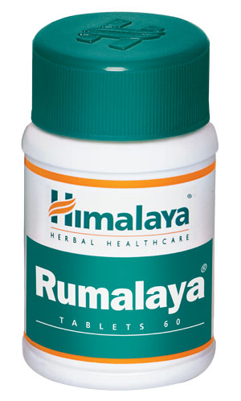

# Rumalaya

[TOC]

**Rumalaya** is a phytopharmaceutical formulation that relieves joint and bone ache associated with various orthopedic ailments. Its natural ingredients possess potent anti-inflammatory properties that alleviate pain. As an immunomodulator, Rumalaya modulates both the humoral and cell-mediated immune response to aches and pain. The medicine has strong anti-arthritic properties that work to combat arthritis.

## Key ingredients
**Drumstick** (Shigru) improves blood circulation to the joints in addition to its anti-inflammatory and analgesic properties, which are beneficial in treating joint aches and pains related to arthritis and rheumatism. Drumstick is also a rich source of minerals such as calcium, phosphorous and magnesium, all of which are essential for bodily development, growth and for strengthening bones and teeth.

**Indian Tinospora** (Guduchi) is a potent anti-inflammatory that is useful in treating joint gout, arthritis and other inflammatory joint conditions.

## List of Ayurvedic herb in which used in this preparation
[Zingiber officinale](../../herbs/Zingiber_officinale.md)
