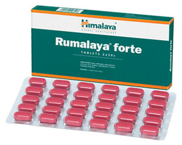

# Rumalaya forte

Rumalaya forte is a potent and safe phytopharmaceutical formulation that relieves joint and bone aches associated with various orthopedic ailments. Its natural ingredients possess potent anti-inflammatory properties that alleviate pain. As an immunomodulator, Rumalaya modulates both the humoral and cell-mediated immune response to aches. Rumalaya forte reduces degeneration of glycosaminoglycans (GAGs), inhibits master cytokines and prevents cartilage damage.

## Key ingredients
**Boswellia’s** (Shallaki) gum resin extract is effective in reducing joint swelling, pain, stiffness and other symptoms of inflammatory joint disorders including rheumatoid arthritis and osteoarthritis. The herb improves the blood supply to the joints and restores the integrity of blood vessels destroyed by spasms. The degradation of glycosaminoglycans, which leads to articular damage and cartilage breakdown, is a common condition in patients on non-steroidal anti-inflammatory drugs (NSAIDs). Boswellia significantly reduces the degradation of glycosaminoglycans and protects the joints.

**Indian Bdellium** (Guggul) is an anti-inflammatory agent and antioxidant that inhibits the formation of nitric oxide, which can cause further oxidative damage to degenerate joints and bones.
