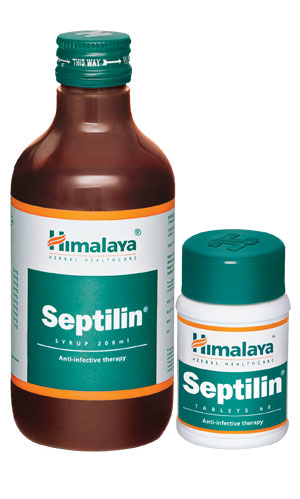

# Septilin

Septilin’s immunomodulatory, antioxidant, anti-inflammatory and antimicrobial properties are beneficial in maintaining general well-being. It increases the level of antibody-forming cells, thereby elevating the body’s resistance to infection. Septilin stimulates phagocytosis (elimination of bacteria through ingestion) by macrophage (white blood cells) activation, which combats infection.

**Other benefits:** Septilin possesses antipyretic (reduces fever) properties. It is also beneficial in respiratory tract infections, including chronic tonsillitis, pharyngitis, chronic bronchitis, nasal catarrh (mucous membrane inflammation of the respiratory tract) and laryngitis.

## Key ingredients
**Tinospora Gulancha** (Guduchi) is a potent antimicrobial that has immunostimulatory properties, which helps in increasing the level of antibodies. This helps in building up the body’s resistance to infections.

**Licorice** (Yashtimadhu) enhances immunostimulation and increases macrophage (white blood cells that ingests antibodies) function in vitro. It is also an antiviral agent and an expectorant, which is beneficial in asthma, acute or chronic bronchitis and chronic cough.

**Indian Bdellium** (Guggulu) has anti-inflammatory properties, which soothe a sore throat and help reduce inflammation. As an antioxidant, Indian Bdellium helps in maintaining overall health.
