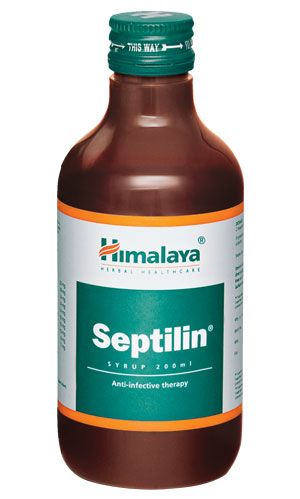

# Septilin syrup

[TOC]

## Action
Enhances immunity: Septilin’s immunomodulatory, antioxidant, anti-inflammatory and antimicrobial properties are beneficial in maintaining general well-being. It increases the level of antibody-forming cells, thereby elevating the body’s resistance to infection. Septilin stimulates phagocytosis (elimination of bacteria through ingestion) by macrophage (white blood cells) activation, which combats infection.

## Indications
* As an immunomodulator in the management of upper and lower respiratory tract infections, allergic disorders of the upper respiratory tract, skin and soft tissue infections, dental and periodontal infections, ocular infections, bone and joint infections and urinary tract infections.
* For early recovery in postoperative conditions

* To reduce recurrence in infection-prone individuals

* As an adjuvant to anti-infective therapy

* Resistance to antibiotic therapy

## Key ingredients
* Ayurveda texts and modern research back the following facts:

* Tinospora Gulancha ([Guduchi](Guduchi.md)) is a potent antimicrobial that has immunostimulatory properties, which helps in increasing the level of antibodies. This helps in building up the body’s resistance to infections.

* Licorice ([Yashtimadhu](Yashtimadhu.md)) enhances immunostimulation and increases macrophage (white blood cells that ingests antibodies) function in vitro. It is also an antiviral agent and an expectorant, which is beneficial in asthma, acute or chronic bronchitis and chronic cough.

* Indian Bdellium ([Guggulu](../../medicines/Guggulu.md)) has anti-inflammatory properties, which soothe a sore throat and help reduce inflammation. As an antioxidant, Indian Bdellium helps in maintaining overall health.

## Directions for use
* Please consult your physician to prescribe the dosage that best suits the condition.

## Side effects
* Septilin is not known to have any side effects if taken as per the prescribed dosage.

## References

## References

1. Products of the Himalaya Drug Company
