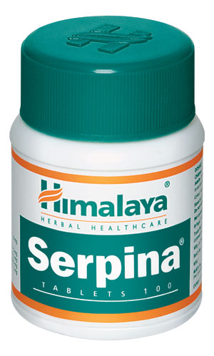

# Serpina

**Serpina** is a single-ingredient formulation for the management of mild to moderate hypertension. The drug depletes peripheral catecholamine (noradrenaline) stores, which results in a reduction of blood pressure. Serpina decreases the adrenergic tone and controls anxiety, and is therefore beneficial in the treatment of anxiety disorders as well.

## Key ingredient
**Rauwolfia** (Sarpagandha) is a pungent smelling herb, which is a potent anti-hypertensive. Its Sanskrit name, Sarpagandha, literally translates to 'smells like a serpent'. Reserpine, an active compound found in Rauwolfia, renders the herb its antihypertensive property. Its anti-hypertensive activity is attributed to a decrease in peripheral resistance and the resulting decrease in cardiac output.
