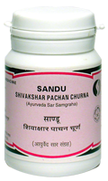

# Shivakshar Pachan Churna

[TOC]

It has carminative action and is useful in flatulence. It has laxative action and is useful in cares of constipation

## Indications
1. Indigestion
1. Anorexia
1. constipation
1. pain in abdomen

## Dose
½ - 1 tsf.

## Ingredients
1. Piper longum
1. Piper nigrum
1. zingiber afficinale
1. carurn
1. aromaticum
1. saindhav
1. Guminum
1. grinum
1. ferula Horlex
1. Terminalia chebuls
1. Sajjikshar, etc.
