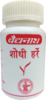

# Shodi Hare

[TOC]

## Importance
Shodhi harre is excellent ayurvedic formulation for abdomen diseases like constipation, gastric problems, digestion disorder, vomiting tendency, loss of appetite, dyspepsia etc.

## Dosage
1-2 pellets to be chewed twice or three times in a day.

## Indications
1. Indigestion
1. Abdominal Colic
1. Constipation
1. Haemorrhoids Intestinal Worms
1. Anorexia
1. Hook Worms
1. Nausea / Vomiting,
1. Dyspepsia,
1. Gastric problems
