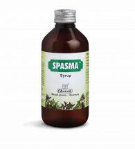

# Spasma Syrup

**Spasma** is a ***natural bronchodilator, antiinflammatory*** and ***immunomodulator***. The major ingredient Vasa (Adhatoda vasica) exerts antiinflammatory activity and offers a potent antiallergic activity. Haridra (Curcuma longa) has antiallergic and antiinflammatory property. Kantakari (Solanum xanthocarpum) exerts bronchodilator activity that relieves the constriction of the airway to ease the flow of air while breathing. Navsadar (Ammonium chloride) and Kantakari (Solanum xanthocarpum) have expectorant property to expel cough easily. Thus, Spasma helps to control severity, frequency, and duration of asthma attacks. Spasma helps to reduce the need for long-term steroid therapy.
