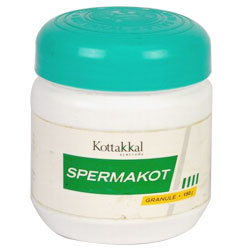

# Spermakot Granule

[TOC]

It is an effective remedy in treating conditions like Male sub-fertility and other male sexual disorders. It can be used as a prophylactic against oligospermia and helps in increasing the sperm count and for treating premature ejaculation.

## Indications for use of Spermakot Granule
Male sub-fertility

## Each 5g Spermakot Granule is prepared out of
* Atmagupta (Mucuna pruriens) - 2.5g
* Satavari (Asparagus racemosus) - 1.6g
* Jatiphala (Myristica fragrans) - 0.83g
