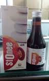

# Stonee Syrup

Urinary calculus is a calculus formed in any part of the urinary tract. Calculi may be large enough to cause an obstruction in the flow of urine or small enough to be passed with the urine. A major causative factor in the development of calculi (stones) is elevated cholesterol levels, which form the basis of that which holds stones (calculi) together.

STONEE is a unique formulation to destroy and reflux out any calculi in urinary tract (kidney, urethra, and urinary bladder).
