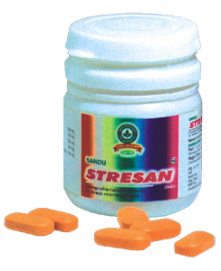

# Stresan

[TOC]

Herbal tranquilizer

## Benefits
1. Relieves stress, strain and anxiety
1. Relieves depression and mental fatigue
1. Calms mind and rejuvenates body
1. Improves physical and mental activities
1. Helps to prevent further complications in hypertension and cardiac diseases

## Indications
1. Anxiety
1. Tension
1. Depression
1. Mental fatigue
1. Memory disturbances
1. Stress related disorders

## Mode of action
It helps to reduce the levels of acetylcholine and histamine, thus relieves stress. Stresan is a good nervine tonic.

## Dose
1- tablets 2 times a day

## Ingredients
Aswagandha (Withania somnifera), Shankhapushpi (Convolvulus pluricaulis), Brahmi (Centella asiatica), Jatamansi (Nordostochys jatamansi), Jotishmati (Celastrus panniculata), Bhringraj (Eclipta alba), Shatavari ( Asparagus racemosus)
