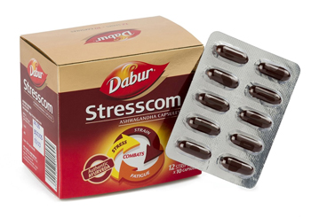

# Stresscom

**Stresscom** are capsules which help relieve stress, general debility, fatigue, anxiety, neurosis and premature old age related syndromes etc. The capsules contain Aswagandha, which is an effective anti-stress agent and one of the most potent adaptogens.

It also aids in improving immunity of the body and physical stamina of individuals etc.

## Key Ingredient
Each capsule contains dry extract of Ashwagandha roots
