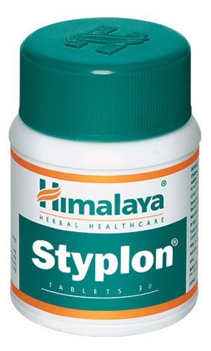

# Styplon

[TOC]

## Action
Hemostatic: Styplon’s hemostatic property controls local tissue hemorrhage effectively. The natural ingredients are also vasoconstrictors, which stops capillary blood flow.

## Indications
* Bleeding gums
* Bleeding hemorrhoids (painful, swollen veins towards the end of the rectum or anus)
* Epistaxis (nosebleed)
* In gynecological bleeding conditions, which include abnormal uterine bleeding, spotting, post intrauterine contraceptive device (IUCD) bleeding
* Hematuria (presence of blood in urine)
* As an adjuvant in hemoptysis (blood-stained sputum)

## Key ingredients
* Ayurveda texts and modern research back the following facts:

* Indian Gooseberry ([Amalaki](Amalaki.md)) has hemostatic, anti-inflammatory and antioxidant properties, which control local tissue hemorrhage, inflammation and oxidative tissue damage respectively.

* Red Coral ([Pravala pishti](Pravala_pishti.md)) is a styptic commonly used in bleeding disorders.

* Indian Sarsaparilla ([Anantamul](Anantamul.md)) is a vasoconstrictor that stops capillary blood flow.

* Lodh Tree ([Lodhra](Lodhra.md)) helps in wound healing.

## Directions for use
* Please consult your physician to prescribe the dosage that best suits your condition.

## Side effects
* Styplon is not known to have any side effects if taken as per the prescribed dosage.

## References

## References

1. Products of the Himalaya Drug Company
