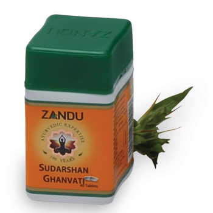

# Sudarshan Ghanvati

[TOC]

1. Improves immunity build-up
1. Helps protect the body from common infections viz, Cold, Body aches etc
1. Helps recovery from infections & chronic illness
1. Helps reduce stress & fatigue, act as antioxidant

BENEFIT TO THE CONSUMER
"Helps keep you healthy and lead an active life"

## Composition
Extract of Maha sudarshan churna 325 mg Triphala (Haritaki, Bibhitaka, Amalaki) FR. 8.66mg, Haridra (Curcuma longa) RZ. 8.66mg, Daruharidra (Berberis aristata) ST 8.66mg, Kantakari (Solanum surattense) WH. PL. 8.66mg, Brhati (Solanum anguivi) WH. PL. 8.66mg, Karcura (Curcuma zedoaria) RZ. 8.66mg, Sunthi (Zingiber officinale) RZ. 8.66mg, Marica (Piper nigrum) FR. 8.66mg, Pippali (Piper longum) FR. 8.66mg, Pippalimool (Piper longum) RT. 8.66mg, Murva (Marsdenia tenacissima) RT. 8.66mg, Guduci (Tinospora cordifolia) ST 8.66mg, Dhanvayasa (Fagonia cretica) WH. PL. 8.66mg, Katuka (Picrorhiza kurroa) RZ 8.66mg, Parpata (Fumaria parviflora) WH. PL. 8.66mg, Musta (Cyperus rotundus) RZ. 8.66mg, Trayamana (Gentiana kurroo) WH. PL. 8.66mg, Gandhsipha, Hrivera (Pavonia odorata) RT. 8.66mg, Nimba (Azadirachta indica) ST. BK. 8.66mg, Puskara (Inula racennosa)RT 8.66mg, Yasti (Glycyrrhiza glabra)RT 8.66mg, Kutaja (Holarrhena antidysenterica) ST. BK. 8.66mg, Yavani (Trachyspermum ammi) FR. 8.66mg, Indrayava (Holarrhena antidysenterica) SD. 8.66mg, Bharangi (Clerodendrum serratum) RT. 8.66mg, Sigru (Moringa oleifera) SD. 8.66mg, Saurastri (Alum) 8.66mg, Vaca (Acorus calamus) RZ 8.66mg, Tvak (Cinnamomum zeylanicum) ST. BK 8.66mg, Padmaka (Prunus cerasoides) HT. WD. 8.66mg, Svetacandana(Santalum album) HT. WD. 8.66mg, Ativisa (Aconitum heterophyllum) RT. 8.66mg, Bala (Sida cordifolia) SD. 8.66mg, Salaparni (Desmodium gangeticum) WH. PL. 8.66mg, Prsniparni (Uraria picta) WH. PL. 8.66mg, Vidanga (Embelia ribes) FR. 8.66mg, Tagara (Valeriana wallichii) RZ 8.66mg, Citraka (Plumbago zeylanica) RT. 8.66mg, Devadaru (Cedrus deodara) HT. WD. 8.66mg, Cavya (Piper retrofractum) ST 8.66mg, Patola (Trichosanthes dioica) WH. PL. 8.66mg, Vidarikand (Pueraria tuberose) RT. 17.32mg, Lavanga (Syzygium aromaticum) FL. BD. 8.66mg, Vamsa (Bambusa arundinacia) S. C. 8.66mg, Kamala Prapaundarika (Nelumbo nucifera) FL. 8.66mg, Asvagandha (Withania somnifera) RT. 8.66mg, Tvakpatra (Cinnamomum tamala) LF 8.66mg, Jatiphala (Myristica fragrans) SD. 8.66mg, Sthauneya (Tams baccata) LE 8.66mg, Kiratatikta (Swertia chirata) WH. PL. 217.0mg

## Dosage
1 to 2 tablets twice a day with water or as directed by the Physician.

* Restores homeostasis of all three dosha. Boosts immunity to fight against allergens and infections. Excellent diaphoretic and Diuretic. Preventive and supportive during epidemic of malaria, allergic cough & cold. Supportive in tuberculosis, recurrent, respiratory infection, indigestion, ama (endotoxicity).
