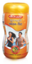

# Sugar free Chawan-Vit

[TOC]

## Importance
Baidyanath chyawan- vit (Sugarfree Chyawanprash) is the only available Chyawanprash which is free from any sugar. It is prepared by Amla and 51 potent herbs and plant extracts. Amla is a rich source of natural vitamin C, minerals and potent herbal nutrients essential to boost body immunity and metabolic activity. It is specially prepared to give the benefits of Chyawanprash to diabetic patients and those who want to avoid sugar. Diabetes affects major body organs heart, lung, liver, kidney, brain & skin. Baidyanath Chyawan-vit protects and nourishes these organs and has the properties to counteract most of the complication attacking these organs due to diabetes. It stimulates the circulatory, nervous and respiratory systems. Hence Baidyanath Chyawan-Vit should be taken as protective and nourishing therapy by all diabetics.

## Dosage
1-2 teaspoons in morning & evening with Baidyanath Honey or milk.

## Indications
1. Increase resistance power of body
1. Natural anti-oxidant
1. Immunity Enhancement
